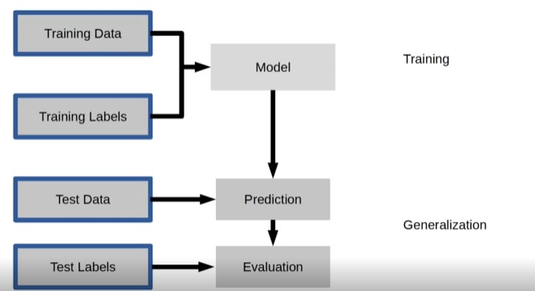
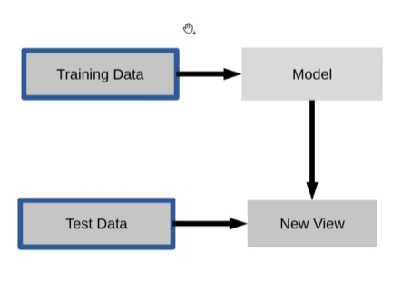
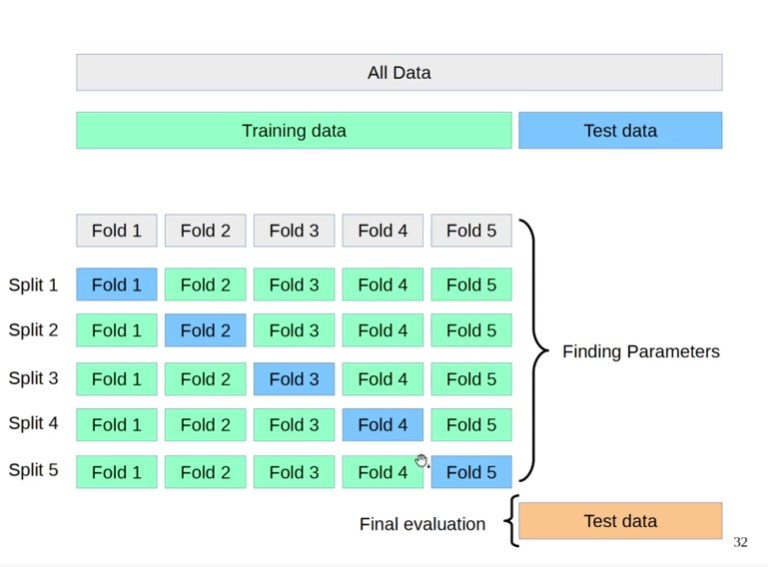
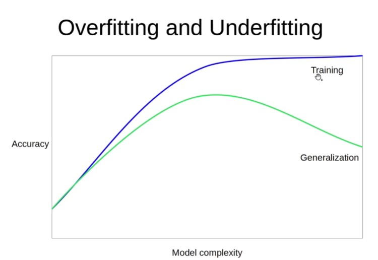
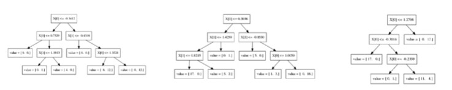

## 1.1
**사이킷런**
1. Classification = 분류, 구분할 수 있는 값이 있을 때 사용.
2. Regression = 효율 측정, 특정 수치를 예상할 때 사용.
3. Clusering = 군집화

**1. Supervised (Machine) learning**
: 정답이 있는 데이터를 맞추는 것.  
(ex. Classification, Regression)  

 
clf = RandomForestClassifier()   
clf.fit(X_train, y_train)   
y_pred = clf.predict(X_text)    
clf.score(X_train, y_train)    

 

**2. Unsupervised (Machine) learning** 
: 정답이 없는 데이터를 맞추는 것.  
(ex. Clustering)  

pca = PCA()  
pca.fit(X_train)  
X_new = pca.transform(X_test)  

 
#### Basic API
estimator.fit(X, [y]) 

|estimator.predict | estimator.transform |
|---|---|
| Classification | Preprocessing |
| Regression | Dimensionality reduction |
| Clustering | Feature slection   Feature extraction|

---

효과적인 파라미터를 찾기 위해서 학습을 시킴.

### Overfitting and Underfiiting

그래프 위에는 Overfitting, 아래는 Underfiiting임.  
test 데이터는 어느 정도 가면 안 좋아짐.  
새로운 objectg에는 잘 적용하지 못하는 모습을 보여줌.  
따라서 Overfitting와 Underfiiting 사이의 적절한 지점을 찾아야 한다.  
Overfitting 심하게 하면 새로운 object를 가져왔을 때 제대로 예측하지 못하는 문제가 발생함. 

 

### Random Forests

모든 데이터를 다 사용하지 않고 데이터를 샘플링해서 예측함. 

 

### Randomized Parameter Search
- Grid Layout
파라미터 지정했을 때 그리드 안에 있는 것만 함. 
- Random Layout
  
 

-> 사이킨 모델에는 Linear Models, Tree-based models로 크게 나온다는 것을 알 수 있음. 

 

### Scoring Function
학습을 했다고 가정했을 때 몇 점 점수를 받는지.
ex. GridSearchCV  
RandomizedSearchCV
cross_val_score
